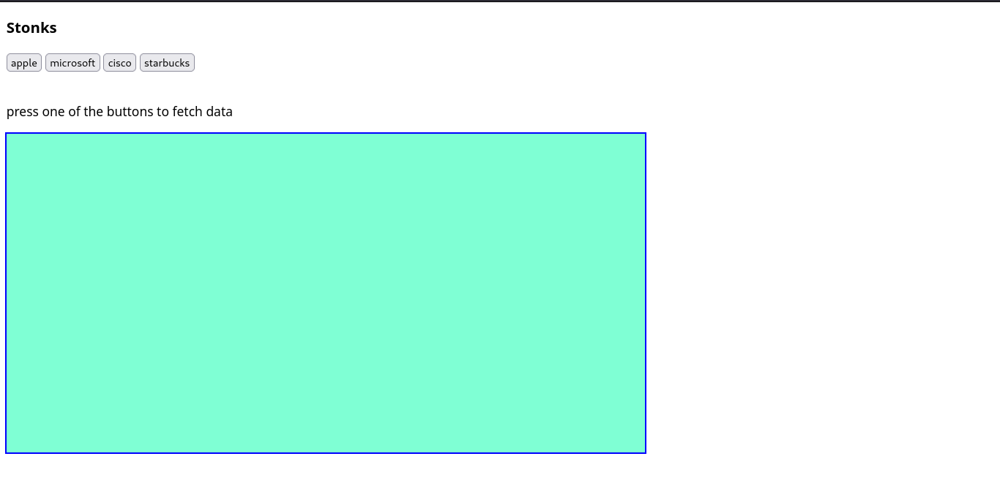
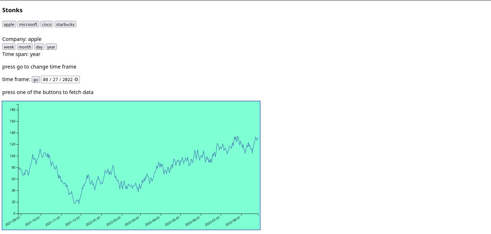

# stonks :rocket:
### Build instructions :hammer_and_wrench:
_clone this repo and cd into the folder_
`git clone --depth 1 *url*

Run:
`npm install`

#### Set environment variables in config/config.env
`PORT` _port you want the server to run on_
`NODE_ENV` : _'development' or 'production'_
`MONGO_U` : _url to your mongodb instance_

#### Setup:
Run this to generate random stock values
`node dbseeder.js`
Run this to delete values in database
`node dbdelete.js`

To start the app run
`npm run watch`


#### Screenshots:camera: :




### How the app works
#### Api
_endpoint_ : <url>/api/v1/
_method_ : POST
_body_ : ```
{
    company: <companyname>
    frm: "2022-02-01"
    to: "2022-03-01"
}```


#### App

- app uses **d3js** to draw svg
- pure html is used for front end
- api fetch results are cached
- you can select the stocks, timeframe and timeperiod
